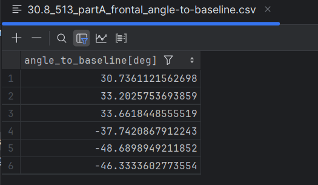
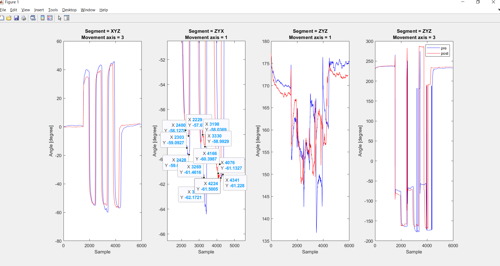

# Ascertaining-cervical-range-of-motion-from-IMU-sensors
This repository includes Matlab code for extract relative angle between two IMU sensors.
The code is based on the following paper: Ascertaining cervical range of motion from IMU sensors.

This study is a data descriptor of extraction cervical range of motion includes two parts.

#### Part A (Validation) 
This part aims to validate the extract angle from IMU sensors using the gold-standard method, a goniometer.

The main script is 'Analyze_PartA_Validation.m',
the scripts read the data and extract the angle from the IMU sensors.

<div style="text-align:center">
  
  <p>Figure 1: Universal goniometer, sensor placement, and reference system description. The
Subject exhibits sensor and Goniometer placement for 3 planes. (A) Sagittal plane
movement Flexion / Extension (Y axis). (B) Frontal plane movement, side Flexion (Z axis). (C)
Horizontal plane movement, rotation (X-axis).</p>
</div>

#### Part B (Reliability)
This part aims to assess the consistency of the measures by extracting the angle of the same movements recorded at different times.

The main script is 'Analyze_PartB_Reliability.m',
the scripts read the data and extract the angle from the IMU sensors.

<div style="text-align:center">
  
  <p>Figure 2: Sensor placement and body positioning for Part B. (A) Subject exhibiting
flexion/extension (sagittal). (B) Subject exhibiting side flexion (Frontal). (C) Subject exhibiting
rotation (Horizontal).</p>
</div>

### Data
The data structure is detailed in the manuscript.

### Run the code
* Change data_path variable to the path of the data.
* Run the script to get the angle along the session, and save the results in the 'Results' folder.

### Part A (Validation)
```matlab
Analyze_PartA_Validation
```
1. Select the desired data file for the analysis.

   
   
2. The script will plot the angle extracted from the IMU sensors for the 6 movements of the desired plane. 
Choose the desired segment and proceed to the next step, as instructed in the pop-up window.

   
   
3. Example of 12 data cursors selected for the 6 movements of the desired plane.

   
   
4. The angle extracted from the IMU sensors as csv file.

   
   

### Part B (Reliability)
```matlab
Analyze_PartB_Reliability
```
1. Select the desired trails for the analysis, first pre then post.
    
   
   
   

2. Select the desired anatomical plane for the analysis.

   
   
3. Follow the instructions in the pop-up window to calibrate the data.

   
   
3.1. Select two points for the calibration (Pre - Blue, Pre - Red).
    
   

3.2. Adjust offset and onset of the angles according to the calibration points.

   

4. Follow the instructions in the pop-up window and choose the desired segment and select 24 points.

    

5. Example of 24 data cursors selected for the 6 movements of the desired plane.

    
    
    
    
    

6. The angle extracted from the IMU sensors as csv file.

    
